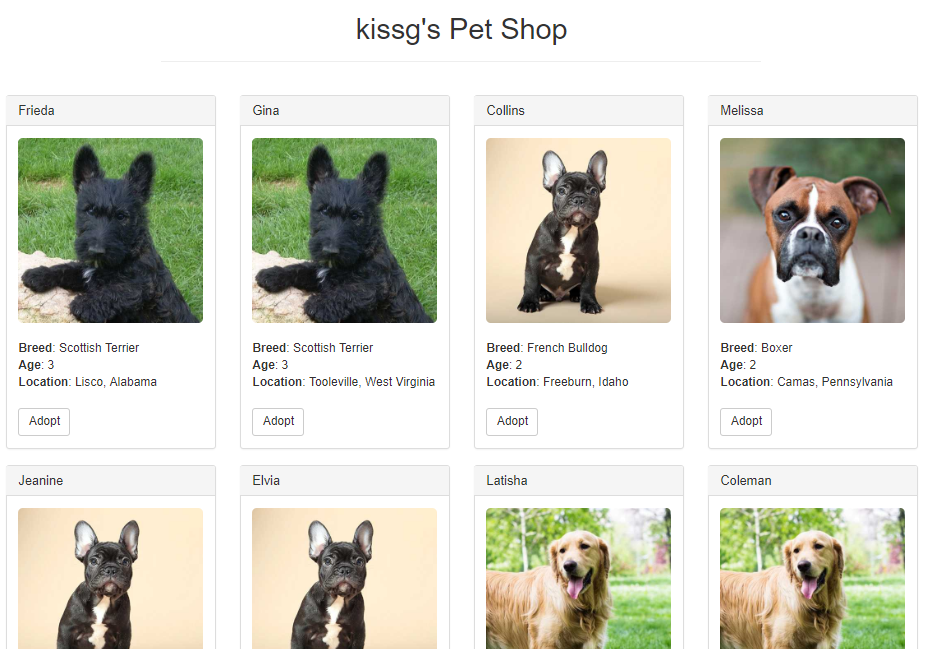
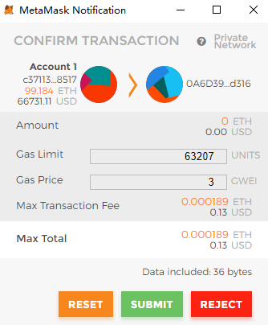
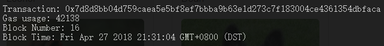
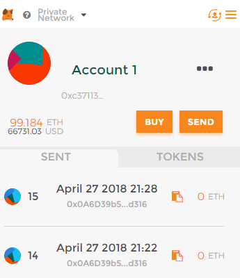
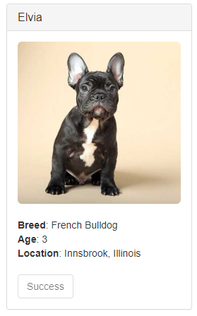

# kissg's Pet Shop

A pet adoption mini-dgame followed [Truffle's Ethereum Pet Shop Tutorial](http://truffleframework.com/tutorials/pet-shop#testing-retrieval-of-a-single-pet-39-s-owner).

#### Requirements:

* [Nodejs](https://nodejs.org/)
* [Ganache CLI](https://github.com/trufflesuite/ganache-cli)
* [Truffle](https://github.com/trufflesuite/truffle)
* [Metamask](https://metamask.io/)

Suppose you have already installed nodejs. (If not, you can easily install it using [nvm](https://github.com/creationix/nvm#installation).)

#### Setups

Install Ganache CLI:

`$ npm install -g ganache-cli`

Install Truffle:

`$ npm install -g truffle`

Install metamask for Chrome [Chrome Web Store](https://chrome.google.com/webstore/detail/metamask/nkbihfbeogaeaoehlefnkodbefgpgknn). (If you use other browsers, check [metamask.io](https://metamask.io/) for corresponding extensions.)

Run ganache-cli (default port is: 8545)

`$ ganache-cli`

Compoile Solidity code to bytecode for EVM (in the project's root directory).

`$ truffle compile`

Migrate the contract to the blockchain (in the project's root directory).

`$ truffle migrate`

Test the smart contract. (Optional)

`$ truffle test`

Run dapp.

`$ npm run dev`

Configure metamask:

1. Click the metamask extension icon, input existing DEN with the mnemonic that is generated by ganache-cli.
2. Change the **Main Network** to **Custom RPC**: `http://127.0.0.1:8545`.

Open `http://localhost:3000`, then adopt your pet!

## Demo

#### Homepage

#### Adopt a pet, initiate the transaction

#### Transaction in Ganache-cli.

#### View view_account

#### Adoption succeeded!

